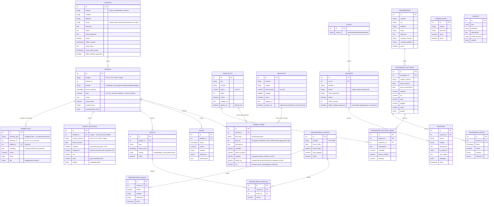

# Esquema de base de datos — sistema-web-mdlt

Diagrama único y actualizado, generado directamente contra el esquema real de producción (Neon Postgres) el 2026-08-28. Reemplaza a `DER-DBDIAGRAM.png` y `MDLT-Mermaid.png` (ambos desactualizados y en desacuerdo entre sí — ver notas al final).

```mermaid
erDiagram
    CLIENTES ||--o{ PEDIDOS : realiza
    PEDIDOS ||--o{ PEDIDO_ITEMS : contiene
    PEDIDOS ||--o{ PAGOS : recibe
    PEDIDOS ||--o{ ENVIOS : genera
    PEDIDOS ||--o| PEDIDO_FACTURAS : factura
    PEDIDOS ||--o{ NOMINA_MOV : "asociado a (opcional)"
    PRODUCTOS ||--o{ PEDIDO_ITEMS : "si item_tipo=producto"
    SERVICIOS ||--o{ PEDIDO_ITEMS : "si item_tipo=servicio"
    ENVIOS ||--o{ SERVIENTREGA_DETALLE : registra
    SERVIENTREGA_CUENTA ||--o{ SERVIENTREGA_DETALLE : agrupa
    SERVIENTREGA_CUENTA ||--o{ SERVIENTREGA_PAGOS : recibe
    ROLES ||--o{ USUARIOS : asigna
    USUARIOS ||--o{ AUDITORIA : genera
    PROVEEDORES ||--o{ PROVEEDOR_FACTURAS : emite
    PROVEEDOR_FACTURAS ||--o{ PROVEEDOR_FACTURA_ITEMS : contiene
    PROVEEDOR_FACTURAS ||--o{ PROVEEDOR_PAGOS : recibe
    PRODUCTOS ||--o{ PROVEEDOR_FACTURA_ITEMS : referencia

    CLIENTES {
        int id PK
        string cedula "unique, identificador canonico"
        string nombre
        string telefono
        string email "unique sobre lower(email) donde no es NULL"
        text direccion
        text notas
        text hash_password
        boolean activo
        timestamp ultimo_acceso
        text reset_token
        timestamp reset_token_expiry
        boolean debe_cambiar_password
    }

    PEDIDOS {
        int id PK
        string codigo "TUTU-YYYY-####, unique"
        int cliente_id FK
        string estado "recibido|en_proceso|terminado|anulado|entregado"
        timestamp fecha_creacion
        numeric total "con IVA: suma de subtotal + iva de sus items"
        text notas
        numeric costo_envio
        string ciudad_envio
        jsonb coordenadas_envio
    }

    PEDIDO_ITEMS {
        int id PK
        int pedido_id FK
        string item_tipo "producto|servicio"
        int item_id "FK logica a PRODUCTOS o SERVICIOS segun item_tipo"
        text descripcion
        numeric cantidad
        numeric precio_unitario
        numeric subtotal "cantidad x precio_unitario, sin IVA"
        boolean graba_iva "copiado del producto/servicio al agregar la linea"
        numeric iva "IVA de la linea, redondeado a centavos"
    }

    PEDIDO_FACTURAS {
        int id PK
        int pedido_id FK "unique - una factura por pedido"
        string numero_factura "FACT-YYYY-####, unique"
        date fecha_emision
        numeric subtotal "base total (gravada + 0%)"
        numeric subtotal_0 "base de los items que no gravan IVA"
        numeric iva
        numeric total "igual a pedidos.total"
        string estado "emitida|anulada"
    }

    PRODUCTOS {
        int id PK
        string sku
        string nombre
        numeric precio "sin IVA"
        int stock
        boolean activo
        text imagen_url
        boolean graba_iva "default true"
    }

    SERVICIOS {
        int id PK
        string nombre
        string unidad
        numeric precio_base "sin IVA"
        boolean variable
        boolean activo
        text imagen_url
        boolean graba_iva "default true (tambien el servicio Envio)"
    }

    PAGOS {
        int id PK
        int pedido_id FK
        timestamp fecha
        numeric monto
        string metodo
        string referencia
        text observacion
    }

    ENVIOS {
        int id PK
        int pedido_id FK
        string guia
        timestamp fecha_envio
        string estado "pendiente|en_proceso|terminado"
        numeric costo
    }

    SERVIENTREGA_CUENTA {
        int id PK
        string periodo "YYYY-MM"
        date fecha_corte
        numeric total_cargos
        numeric total_pagado
        numeric saldo
    }

    SERVIENTREGA_DETALLE {
        int id PK
        int cuenta_id FK
        int envio_id FK
        numeric monto
    }

    SERVIENTREGA_PAGOS {
        int id PK
        int cuenta_id FK
        numeric monto
        string metodo
        string referencia
        timestamp fecha
    }

    TARIFAS_ENVIO {
        int id PK
        string ciudad
        string provincia
        numeric costo
        boolean activo
    }

    NOMINA_MOV {
        int id PK
        string persona_tipo "categoria libre - sin tabla de personas"
        int persona_id "sin FK, no se usa hoy"
        int pedido_id FK "opcional"
        text concepto "incluye nombre de la persona"
        numeric monto
        date fecha
        string tipo "pago|deduccion|bono"
    }

    PROVEEDORES {
        int id PK
        string nombre
        string ruc
        string telefono
        string email
        text direccion
        string contacto_nombre
        string contacto_telefono
        boolean activo
    }

    PROVEEDOR_FACTURAS {
        int id PK
        int proveedor_id FK
        string numero_factura
        date fecha_emision
        date fecha_vencimiento
        numeric subtotal
        numeric iva
        numeric total
        numeric pagado
        numeric saldo
        string estado
    }

    PROVEEDOR_FACTURA_ITEMS {
        int id PK
        int factura_id FK
        int producto_id FK
        text descripcion
        numeric cantidad
        numeric precio_unitario
        numeric subtotal
    }

    PROVEEDOR_PAGOS {
        int id PK
        int factura_id FK
        timestamp fecha
        numeric monto
        string metodo
        string referencia
    }

    ROLES {
        int id PK
        string nombre "administrador|asistente|soporte"
    }

    USUARIOS {
        int id PK
        int rol_id FK
        string nombre
        string email "unique sobre lower(email)"
        string hash_password
        boolean activo
        int token_version
        boolean debe_cambiar_password "contraseña asignada por otra persona"
    }

    AUDITORIA {
        int id PK
        int usuario_id FK
        string accion
        string modulo
        text descripcion
        string ip_address
        text user_agent
        jsonb metadata
        timestamp fecha
    }

    TICKETS {
        int id PK
        string tipo
        string prioridad
        text descripcion
        string email_contacto
        string estado
    }
```

## Notas honestas (auditoría del esquema real, no de los scripts locales)

Este diagrama se generó consultando `information_schema` directamente contra la base de producción, no contra `scripts/*.sql` — los scripts locales están incompletos respecto al esquema real (ver hallazgos abajo).

**Tablas legacy encontradas en la base de datos, sin uso en el código actual — no incluidas en el diagrama de arriba:**
- `facturas_proveedor` y `factura_items` — duplicado exacto y no usado de `PROVEEDOR_FACTURAS`/`PROVEEDOR_FACTURA_ITEMS`, que es lo que el código realmente usa (`app/api/proveedores/[id]/facturas/route.ts`). Probablemente una renombrada a medias en algún momento del desarrollo con v0.
- `playing_with_neon` — tabla demo que Neon crea por defecto en proyectos nuevos, sin relación con la app.
- Columna `clientes.requiere_cambio_password` — reemplazada por `clientes.debe_cambiar_password` (la que sí usa `app/api/clientes/route.ts`), quedó huérfana.

Ninguna de estas se eliminó — solo se documenta que existen pero no se usan, por si en algún momento quieren limpiar la base.

**IVA (migración `0003_ronda_3`):** los precios del catálogo no incluyen IVA. `productos.graba_iva` y `servicios.graba_iva` (por defecto `true`) indican si el ítem grava el 15 % (`lib/iva.ts`, única fuente de la tarifa). Al agregar una línea, `pedido_items` copia `graba_iva` y guarda su `iva` redondeado a centavos; cambiar el flag del catálogo no altera pedidos existentes. `pedidos.total = Σ subtotal + Σ iva`: es lo que se cobra, lo que exige el cierre (saldo cero) y lo que suma la factura (`pedido_facturas.total`). Las líneas anteriores a la migración quedaron con `graba_iva = false` e `iva = 0`, así sus totales históricos no cambiaron.

**Emails (migración `0003_ronda_3`):** se guardan normalizados (trim + minúsculas) y son únicos sin distinguir mayúsculas: `usuarios_email_lower_key` y `clientes_email_lower_key` (parcial, `WHERE email IS NOT NULL`) son índices únicos sobre `lower(email)`, la misma expresión que usa `emailIgual` en las búsquedas. Se quitaron `idx_usuarios_email`, `idx_clientes_email` e `idx_clientes_email_unique`, que quedaron redundantes; `usuarios_email_key` (UNIQUE sobre `email`) se mantiene.

**`usuarios.debe_cambiar_password`:** queda en `true` cuando la contraseña la asigna otra persona (alta de usuario por soporte o un administrador, reseteo, `scripts/create-admin.ts`). Mientras esté activa el usuario solo puede usar `/cambiar-password`.

**Relación `PEDIDO_ITEMS` → `PRODUCTOS`/`SERVICIOS`:** no es una foreign key real en la base de datos (no hay constraint), es una relación lógica resuelta en código según el valor de `item_tipo`. Se documenta como tal en el diagrama.

## Historial de versiones del modelo de pedido (para contexto)

Hubo tres versiones distintas del modelo de líneas de pedido a lo largo del proyecto:
1. `DER-DBDIAGRAM.png` (más antiguo): proponía `pedido_productos` + `pedido_servicios` como tablas separadas.
2. `MDLT-Mermaid.png`: ya usaba `pedido_items` unificado, más cerca de la realidad.
3. **Este documento**: refleja lo que existe hoy en producción — `pedido_items` unificado, confirmado contra el esquema real.

Los dos PNG viven fuera de este repositorio (en `D:\respaldo\PROYECTOS PERSONALES\MDLT\`, no en `sistema-web-mdlt\`) y no se tocaron — puedes archivarlos o borrarlos cuando quieras, este documento es ahora la referencia única y vive versionado junto al código.
